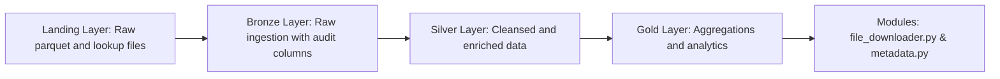

# 🚕 Databricks NYC Taxi Data Pipeline

## 🧭 Overview
This project demonstrates an end-to-end ELT pipeline on **Azure Databricks** using the **NYC Taxi dataset**, following the **Medallion Architecture** (Landing → Bronze → Silver → Gold).  
It automates monthly ingestion, transformation, enrichment, and analytics — showcasing **PySpark**, **Delta Lake**, and **Databricks Jobs orchestration**.

> Data Source: [NYC Taxi & Limousine Commission Trip Record Data](https://www.nyc.gov/site/tlc/about/tlc-trip-record-data.page)  
> Note: The dataset is published with a two-month delay, so ingestion runs using *current_month – 2* logic.

---

## 🏗️ Architecture


📊 Data Model & Job Flow
🧩 Architecture Diagram

https://github.com/vinayusa03/nyctaxi_project/blob/f2b32fd2d33d9dad1ce6bed93ace3461c4c6c795/Data_Model.png

⚙️ Databricks Job Execution Flow

https://github.com/vinayusa03/nyctaxi_project/blob/f2b32fd2d33d9dad1ce6bed93ace3461c4c6c795/nyctaxi_job_flow.png

```text
nyctaxi_project/
│
├── ad_hoc/                 # EDA notebooks and analysis queries
├── modules/                # Custom reusable PySpark utilities
│   ├── data_loader/        # download_file()
│   └── transformation/     # add_processed_timestamp()
│
├── one_off/                # Initial catalog, schema, and volume setup
│
└── transformation/
    ├── 00_landing/         # Ingest monthly parquet & lookup files
    ├── 01_bronze/          # Load raw data with audit columns
    ├── 02_silver/          # Cleanse, enrich, and apply SCD Type-2
    └── 03_gold/            # Aggregate daily trip summaries
```
⚙️ Key Features & Technologies

- Databricks Notebooks & Jobs for orchestration
- Delta Lake for versioned tables, MERGE, and Time Travel
- PySpark transformations and business logic mappings
- dbutils for parameter passing between tasks
- Automated monthly ingestion of parquet data from NYC Taxi source
- SCD Type-2 logic for taxi_zone_lookup
- Cleansed (Silver), Enriched (Silver), and Curated Analytics (Gold) layers

🔄 ETL Flow Summary

1️⃣ Landing
- Downloads current_month – 2 parquet file and lookup CSV using urllib and shutil.
- Saves data into /Volumes/nyctaxi/00_landing/data_sources/.

2️⃣ Bronze
- Loads raw data and adds audit columns:
  - processed_timestamp
  - process_month
  - file_path
- Persists to nyctaxi.01_bronze.yellow_trips_raw.

3️⃣ Silver
- Cleansed Layer:
  - Filters records by current processing month.
  - Applies business logic for vendor, rate_type, and payment_type.
  
- Enriched Layer:
  - Joins lookup for pickup/dropoff borough & zone.
  - Derives trip duration and geo information.
  - Implements SCD Type-2 merge on taxi_zone_lookup.

4️⃣ Gold
- Aggregates daily trip summaries including:
  - Total trips
  - Average passengers per trip
  - Fare range
  - Total revenue
- Stores results in nyctaxi.03_gold.daily_trip_summary.

📊 Exploratory Data Analysis

EDA notebooks derive insights such as:

  - 🗓️ Top revenue days
  - 💳 Payment type distributions
  - 🗺️ Borough-level trip density
  - 🚖 Vendor and trip-distance analysis

🧼 Delta Maintenance & Optimization

Time Travel
```sql
SELECT * 
FROM nyctaxi.02_silver.taxi_zone_lookup 
VERSION AS OF 5;
```

VACUUM (post-MERGE cleanup to reclaim space)
```sql
VACUUM nyctaxi.02_silver.taxi_zone_lookup RETAIN 168 HOURS;
```
OPTIMIZE (optional performance improvement)
```sql
OPTIMIZE nyctaxi.02_silver.yellow_trips_enriched 
ZORDER BY (pu_borough, do_borough);
```

🚀 How to Run
1. Setup Unity Catalog & Volumes
  ```sql
  CREATE CATALOG IF NOT EXISTS nyctaxi;
  CREATE SCHEMA IF NOT EXISTS nyctaxi.00_landing;
  CREATE SCHEMA IF NOT EXISTS nyctaxi.01_bronze;
  CREATE SCHEMA IF NOT EXISTS nyctaxi.02_silver;
  CREATE SCHEMA IF NOT EXISTS nyctaxi.03_gold;
  CREATE VOLUME IF NOT EXISTS nyctaxi.00_landing.data_sources;
  ```

2. Execute in Sequence

  1. 00_landing/ingest_taxi_zone_lookup
  2. 00_landing/ingest_yellow_trips
  3. 01_bronze/yellow_trips_raw
  4. 02_silver/taxi_zone_lookup
  5. 02_silver/yellow_trips_cleansed
  6. 02_silver/yellow_trips_enriched
  7. 03_gold/daily_trip_summary
  8. (Optional) EDA Notebook.

3. Automate Monthly
   
  - Schedule the above sequence using Databricks Jobs for continuous ingestion and processing.

🎓 About the Author

Vinay K Ravikumar — Databricks Certified Data Engineer Associate
View Certification
  - After 10 years of building robust ETL solutions, I’ve moved into data engineering on Databricks, where cloud, Spark, and Delta Lake meet.
  I love solving end-to-end data challenges—from ingestion to analytics—by combining engineering rigor with automation and scalability.
